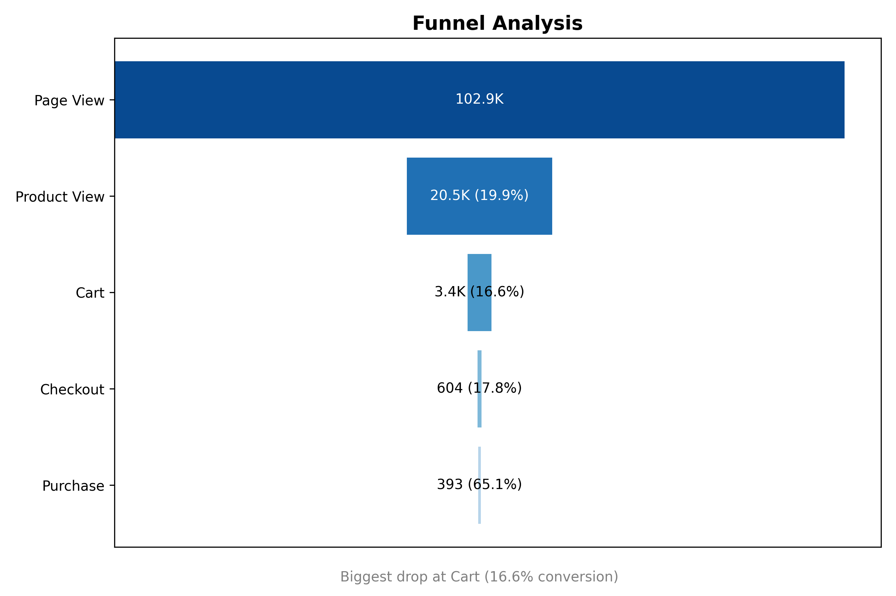
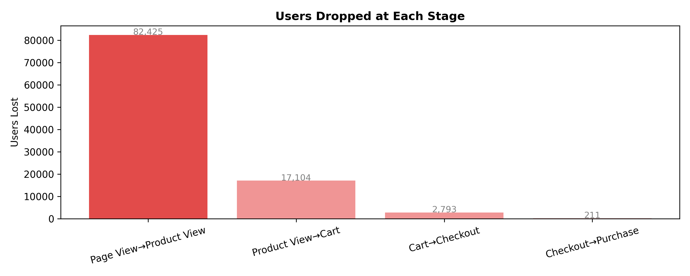
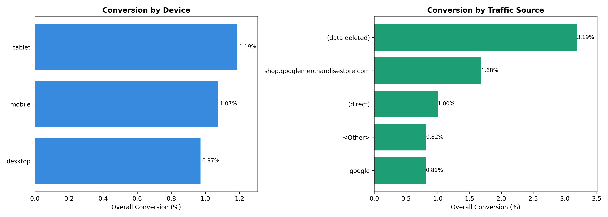

# 📊 GA4 User Daily Funnel Analysis

## Pendahuluan

Proyek ini menganalisis perilaku pengguna dalam alur pembelian (*conversion funnel*) menggunakan data harian dari **Google Analytics 4 (GA4)**. Dataset mencakup jejak aktivitas pengguna mulai dari kunjungan halaman hingga transaksi pembelian, serta dimensi segmentasi seperti tipe perangkat dan sumber traffic.

Analisis ini bertujuan untuk mengidentifikasi di mana pengguna paling banyak keluar dari funnel, segmen mana yang paling efisien dalam menghasilkan konversi, dan peluang optimasi apa yang tersedia bagi tim pemasaran dan produk.

---

## Business Questions

1. **Seberapa besar tingkat konversi keseluruhan** dari pengguna yang mengunjungi halaman hingga melakukan pembelian?
2. **Di tahap mana terjadi drop-off terbesar** dalam funnel pembelian?
3. **Perangkat apa** yang menghasilkan konversi tertinggi?
4. **Sumber traffic mana** yang paling efektif dalam menghasilkan pembelian?

---

## 📁 Struktur Proyek

```
├── data/                 # Dataset mentah atau hasil ekstraksi
│   └── ga4_user_daily_funnel.csv
├── sql/                  # Query SQL yang dipakai untuk ekstraksi
│   └── funnel_query.sql
├── notebooks/            # Notebook eksplorasi & analisis
│   └── funnel_analysis.ipynb
├── images/               # Output visualisasi
│   ├── funnel_chart.png
│   ├── segment_comparison.png
│   └── user_dropoffs.png
└── README.md             # Dokumentasi proyek
```

---

## Data Understanding

**Dataset:** `ga4_user_daily_funnel.csv`

| Info | Detail |
|------|--------|
| Jumlah baris | 115.711 |
| Jumlah kolom | 10 |
| Missing values | Tidak ada |
| Duplikat baris | 0 |
| Duplikat user-date | 9.146 |

**Kolom yang tersedia:**

| Kolom | Tipe | Keterangan |
|-------|------|------------|
| `event_date` | int64 | Tanggal event (format YYYYMMDD) |
| `user_pseudo_id` | float64 | ID unik pengguna |
| `device_type` | object | Tipe perangkat (desktop/mobile/tablet) |
| `traffic_source` | object | Sumber traffic pengguna |
| `page_views` | int64 | Jumlah halaman yang dilihat |
| `product_views` | int64 | Jumlah produk yang dilihat |
| `carts` | int64 | Jumlah item yang ditambahkan ke keranjang |
| `checkouts` | int64 | Jumlah proses checkout |
| `purchases` | int64 | Jumlah pembelian |
| `purchased_flag` | int64 | Flag apakah user melakukan pembelian (0/1) |

> Terdapat 9.146 duplikat kombinasi user-date, menandakan satu pengguna bisa memiliki lebih dari satu sesi dalam sehari (misalnya dari device atau traffic source berbeda). Hal ini ditangani pada tahap data cleaning.

---

## Data Cleaning

Setelah pembersihan data, dataset yang digunakan untuk analisis funnel utama (`df_user`) berisi **102.951 baris**.

Langkah-langkah yang dilakukan:
- Konversi format tanggal dari `int64` ke `datetime`
- Agregasi data per `event_date` × `user_pseudo_id` untuk menghilangkan duplikat sesi
- Penghapusan baris tidak logis (checkout > carts, atau purchases > checkouts)
- Penghapusan pengguna tidak aktif (tidak ada aktivitas sama sekali)

---

## Feature Engineering

Dibuat kolom biner untuk menandai apakah pengguna mencapai setiap tahap funnel:

| Kolom Baru | Logika |
|------------|--------|
| `stage_page_view` | `page_views > 0` |
| `stage_product_view` | `product_views > 0` |
| `stage_cart` | `carts > 0` |
| `stage_checkout` | `checkouts > 0` |
| `stage_purchase` | `purchases > 0` |

---

## 📉 Hasil Analisis Funnel

### Overall Conversion Funnel




<br>

| Tahap | Jumlah Pengguna | Conversion Rate (dari tahap sebelumnya) | Drop-off Rate |
|-------|----------------|-----------------------------------------|---------------|
| Page View | 102.926 | 100% (baseline) | 0% |
| Product View | 20.501 | **19.9%** | 80.1% |
| Cart | 3.397 | 16.6% | 83.4% |
| Checkout | 604 | 17.8% | 82.2% |
| Purchase | 393 | 65.1% | 34.9% |

**Overall Conversion Rate (Page View → Purchase): `0.38%`**

> 🔴 **Biggest drop-off:** Tahap **Page View → Product View** dengan hanya **19.9%** pengguna yang melanjutkan. Artinya, lebih dari 80% pengunjung keluar sebelum melihat satu produk pun.

### Drop-off per Tahap (Jumlah Pengguna Hilang)

| Transisi | Pengguna Hilang |
|----------|-----------------|
| Page View → Product View | 82.425 |
| Product View → Cart | 17.104 |
| Cart → Checkout | 2.793 |
| Checkout → Purchase | 211 |

---
## Segmentasi

---

## 📱 Segmentasi: Perangkat (Device Type)

| Device | Page Views | Purchases | Overall Conversion |
|--------|-----------|-----------|-------------------|
| Tablet | 2.441 | 29 | **1.19%** |
| Mobile | 43.632 | 469 | **1.07%** |
| Desktop | 63.625 | 618 | **0.97%** |

> **tablet** memiliki conversion rate tertinggi (1.19%), diikuti **mobile** (1.07%), lalu **desktop** (0.97%). Namun dari sisi volume, **desktop** tetap menghasilkan pembelian terbanyak (618 purchases).

---

## Segmentasi: Traffic Source

| Traffic Source | Page Views | Purchases | Overall Conversion |
|---------------|-----------|-----------|-------------------|
| (data deleted) | 4.644 | 148 | **3.19%** |
| shop.googlemerchandisestore.com | 7.731 | 130 | **1.68%** |
| (direct) | 25.685 | 256 | **1.00%** |
| \<Other\> | 31.012 | 253 | **0.82%** |
| google | 40.626 | 329 | **0.81%** |

> Fokus pada channel yang bisa dioptimasi yaitu `shop.googlemerchandisestore.com` dengan conversion 1.68%, hampir 2x lipat dibanding Google organic search. (data deleted) diabaikan karena tidak representatif dan tidak actionable.

---

## Business Insights & Rekomendasi

### 1. Prioritas Utama: Perbaiki Page → Product View
Tahap awal funnel menunjukkan drop-off terbesar, di mana hanya sekitar **19.9%** pengguna yang melanjutkan dari Page View ke Product View. Temuan ini mengindikasikan bahwa sebagian besar pengguna belum terdorong untuk mengeksplorasi produk lebih lanjut.

Hal tersebut dapat berkaitan dengan beberapa faktor, seperti relevansi landing page, kualitas traffic yang masuk, struktur navigasi website, maupun kurang terlihatnya produk pada halaman awal.

**Rekomendasi:** 
- Melakukan A/B testing pada halaman beranda atau landing page
- Menampilkan produk populer atau promo utama pada area above the fold
- Mempermudah navigasi menuju halaman produk melalui kategori, rekomendasi produk, atau internal linking

### 2. Optimalkan Pengalaman Mobile & Tablet
Segmentasi device menunjukkan bahwa pengguna mobile dan tablet memiliki conversion rate sedikit lebih tinggi dibanding desktop. Meskipun selisihnya tidak terlalu besar, temuan ini menunjukkan bahwa pengalaman pengguna pada perangkat mobile tetap penting untuk diperhatikan.

Dalam konteks e-commerce, mayoritas traffic umumnya berasal dari perangkat mobile, sehingga peningkatan kecil pada mobile experience dapat berdampak pada performa bisnis.

**Rekomendasi:** 
- Audit mobile checkout flow
- Pastikan halaman produk responsif dan cepat

### 3. Fokus Budget ke Channel Berkualitas Tinggi
`shop.googlemerchandisestore.com` dan `(direct)` menunjukkan kualitas traffic yang relatif lebih tinggi dibanding Google organic. Hal ini mengindikasikan bahwa pengguna dari source tersebut kemungkinan memiliki purchase intent yang lebih kuat.

**Rekomendasi:** 
- Mempertahankan dan mengoptimalkan channel dengan conversion rate tinggi
- Melakukan evaluasi terhadap strategi acquisition untuk traffic organic

### 4. Cart → Purchase: Tahap Terkuat
Meskipun jumlah pengguna yang mencapai tahap checkout relatif kecil, conversion rate dari **Checkout → Purchase** mencapai **65.1%**, yang menunjukkan bahwa pengguna yang sudah masuk ke tahap akhir funnel cenderung memiliki niat membeli yang cukup kuat.

Hal ini mengindikasikan bahwa hambatan utama kemungkinan berada pada tahap awal funnel, khususnya pada proses eksplorasi produk dan akuisisi traffic.

**Rekomendasi:** 
- Memprioritaskan optimasi pada tahap awal funnel sebelum checkout
- Mempertahankan pengalaman checkout yang sudah relatif baik
---